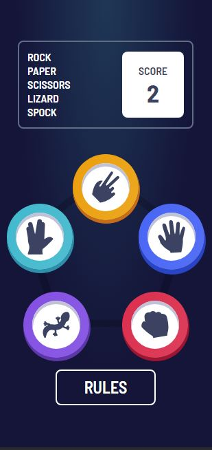

# Frontend Mentor - Rock, Paper, Scissors solution

This is a solution to the [Rock, Paper, Scissors challenge on Frontend Mentor](https://www.frontendmentor.io/challenges/rock-paper-scissors-game-pTgwgvgH). Frontend Mentor challenges help you improve your coding skills by building realistic projects.

## Table of contents

- [Overview](#overview)
  - [The challenge](#the-challenge)
  - [Screenshot](#screenshot)
  - [Links](#links)
- [My process](#my-process)
  - [Built with](#built-with)
  - [What I learned](#what-i-learned)
  - [Continued development](#continued-development)
- [Author](#author)

**Note: Delete this note and update the table of contents based on what sections you keep.**

## Overview

### The challenge

Users should be able to:

- View the optimal layout for the game depending on their device's screen size
- Play Rock, Paper, Scissors against the computer
- **Bonus**: Play Rock, Paper, Scissors, Lizard, Spock against the computer _(optional)_

### Screenshot

### Links

- [CodeSandbox](https://codesandbox.io/p/github/maryammoshtoofar/rock-paper-scissors-game/main)
- [Github Pages](https://maryammoshtoofar.github.io/rock-paper-scissors-game)

## My process

### Built with

- [React](https://reactjs.org/)
- TailwindCSS
- Typescript 4.9.5
- Mobile-first workflow

### What I learned

- how to work with React Context API when handling multiple states and state changes
- how to create my own custom hooks
- typing correctly with Typescript

### Continued development

I'd like to continue working on rendering elements on the page based on state changes and see if one can make their sudden appearance on the page more visually appealing

## Author

- Website - [Maryam Moshtoofar](https://maryammoshtoofar.github.io/)
- Frontend Mentor - [@maryammoshtoofar](https://www.frontendmentor.io/profile/maryammoshtoofar)
- CodePen - [@maryammoshtoofar](https://codepen.io/maryammoshtoofar)

